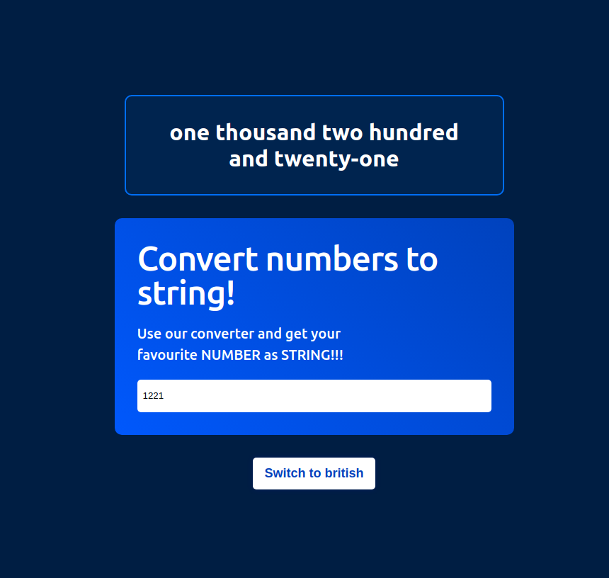

# Arabic number conversion tool

The application converts a non negative numeric input into the English phrase of that number.
The provided number has to be less than 1.000.000.000.000.

## Usage

After cloning the project you can run the app in development mode with: `npm run start`

## Tests

You can run the tests with: `npm run test`

## Built with
- React
- Typescript

## App preview

